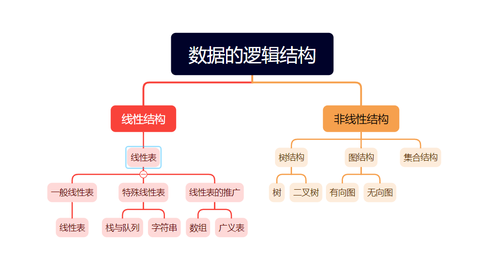

# 第一章 绪论

## 掌握

### 数据结构的基本概念和相关术语

- 数据：是客观事物的符号表示，是所有能输入到计算机中并被计算机程序处理的符号的总称
- 数据元素：是数据的基本单位，在计算机中通常作为一个整体进行考虑和处理
- 数据项：是组成数据元素的、有独立含义的、不可分割的最小单位
- 数据对象：是性质相同的数据元素的集合，是数据的一个子集
- 数据结构：是相互之间存在一种或多种特定关系的数据元素的集合（包括逻辑结构、存储结构和数据的运算）

### 数据的逻辑结构和存储结构的分类

#### 逻辑结构



#### 存储结构

##### 顺序存储

顺序存储结构是借助元素在存储器中的相对位置来表示数据元素之间的逻辑关系，通常借助程序设计语言的数组类型来描述

##### 链式存储

链式存储无需占用一整块存储空间，但为了表示结点之间的关系，需要给每个结点附加指针字段，用于存放后继元素的存储位置。所以链式存储结构通常借助于程序设计语言的指针类型来描述

## 熟悉

### 数据的逻辑结构、存储结构和运算之间的关系

- 数据的逻辑结构和存储结构是密不可分的两个方面，一个算法的设计取决于所选定的逻辑结构，而算法的实现依赖于所采用的存储结构
- 数据的存储结构是用计算机语言实现的逻辑结构，它依赖于计算机语言
- 施加在数据上的运算包括运算的定义和实现。运算的定义是针对逻辑结构的，指出运算的功能；运算的是实现是针对存储结构的，指出运算的具体操作步骤

### 时间复杂度和空间复杂度的概念和分析方法

#### 时间复杂度

一般情况下，算法中基本语句重复执行的次数是问题规模n的某个函数f(n)，算法的时间量记作T(n) = O(f(n))，它表示随问题规模n的增大，算法执行时间的增长率和f(n)的增长率，称作算法的渐进时间复杂度，简称时间复杂度

#### 空间复杂度

算法的空间复杂度S(n)定义为该算法所需的存储空间，它是问题规模n的函数，记作S(n)=O(g(n))

## 了解

- 数据类型：是一个值的集合和定义在此值集上的一组操作的类型
- 抽象数据类型：一般指由用户定义的、表示应用问题的数学模型，以及定义在这个模型上的一组操作的总称，具体包括三部分：数据对象、数据对象上关系的集合以及对数据对象的基本操作的集合

# 第二章 线性表

## 掌握

### 线性表的顺序存储的定义，查找、插入和删除等基本操作的是实现

#### 定义

```c
//静态分配
#define MaxSize 50			//定义线性表的最大长度
typedef struct {
    ElemType data[MaxSize];	//顺序表的元素
    int length;				//顺序表的当前长度
}SqList；				   //顺序表的类型定义
//动态分配
#define InitSize 100		//表长度的初始定义
typedef struct {
    ElemType *data;			//指示动态分配数组的指针
    int MaxSize,length;		//数组的最大容量和当前个数
}SeqList；				   //动态分配数组顺序表的类型定义
```

#### 初始化

```c
//静态分配
//Sqlist L；					//声明一个顺序表
void InitList(SqList &L) {
    L.length = 0;			//顺序表初始长度为0
}
//动态分配
void InitList(SeqList &L) {
    L.data = (ElemType *)malloc(InitSize*sizeof(ElemType));		//分配存储空间
    L.length = 0;		//顺序表初始长度为0
    L.MaxSize = InitSize;		//初始存储容量
}
```

#### 查找(按值查找，顺序查找)

```c
int LocateElem(SqList L,ElemType e) {
    for (int i = 0;i<L.length;i++) {
        if (L.data[i] == e) {
            return i+1;		//下标为i的元素等于e，返回其位序i+1
        }
    }
    return 0;		//退出循环，说明查找失败
}
```

#### 插入操作

```c
bool ListInsert(SqList &L,int i,ElemType e) {
    if (i<1||i>L.length=1) {		//判断i的范围是否有效
        return false;
    }
    if (L.length >=MaxSize){		//当前存储空间已满，不能插入
        return false;
    }
    for (int j = L.length;j>=i;j--) {		//将第i个元素及之后的元素后移
        L.data[j] = L.data[j-1];
    }
    L.data[i-1] = e;		//在位置i处放入e
    L.length++;		//线性表长度加1
    return true;
}
```

#### 删除操作

```c
bool ListDelete(SqList &L,int i,ElemType &e) {
    if (i<1||i>L.length) {		//判断i的范围是否有效
        return false;
    }
    e = L.data[i-1];		//将被删除的元素赋值给e
    for (int j = i;j<L.length;j++) {		//将第i个位置后的元素前移
        L.data[j-1]=L.data[j];
    }
    L.length--;		//线性表长度减1
    return true;
}
```

### 线性表的链式存储的定义，查找、插入和删除等基本操作的实现

#### 定义

```c
typedef struct LNode {		//定义单链表结点类型
    ElemType data;		//数据域
    struct LNode *next;		//指针域
}LNode, *LinkList;
```

#### 初始化

```c
//带头节点
bool InitList(LinkList &L) {		//带头结点的单链表的初始化
    L = (LNode*)malloc(sizeof(LNode));		//创建头结点
    L->next=Null;		//头结点之后暂时没还没有元素节点
    return true;
}
//不带头结点
bool InitList(LinkList &L) {		//不带头结点的单链表的初始化
    L=NULL;
    return true;
}
```

#### 查找

##### 按序号查找

```c
LNode *GetElem(LinkList L,int i) {
    LNode *p=L;		//指针p指向当前扫描到的结点
    int j = 0;		//记录当前结点的位序，头结点是第0个结点
    while(p!=NULL&&j<i) {		//循环找到第i个结点
        p = p->next;
        j++;
    }
    return p;		//返回第i个结点的指针或NULL
}
```

##### 按值查早表结点

```c
LNode *LocateElem(LinkList L,ElemType e) {
    LNode *p=L->next;
    while (p!=NULL&&p->data!=e) {		//从第一个结点开始查找数据域为e的结点
        p = p->next;
    }
    return p;		//找到后返回该结点指针，否则返回NULL
}
```

#### 插入

```c
bool ListInsert(LinkList &L, int i, ElemType e) {
    LNode *p = L;	//指针P指向当前扫描到的结点
    int j = 0;		//记录当前节点的位序，头结点是第0个结点
    while (p!=NULL&&j<i-1) {	//循环找到第i-1个结点
        p = p->next;
        j++;
    }
    if (p == NULL) {	//i值不合法
        return false;
    }
    LNode *s = (LNode*)malloc(sizeof(LNode));
    s->data = e;
    s->next = p->next;
    p->next = s;
    return true;
}
```

#### 删除

```c
bool ListDelete(LinkList &L,int i,ElemType &e) {
    LNode *p = L;	//指针p指向当前扫描到的结点
    int j = 0;		//记录当前结点的位序，头结点是第0个结点
    while (p!=NULL&&j<i-1) {	//循环找到第i-1个结点
        p=p->next;
        j++;
    }
    if (p==NULL||p->next == NULL) {		//i值不合法
        return false;
    }
    LNode *q = p->next;		//令q指向被删除结点
    e = q->data;			//用e返回元素的值
    p->next = q->next;		//用*q结点从链上断开
    free(q);				//释放结点的存储空间
    return true;
}
```

## 熟悉

### 顺序表、单链表、循环链表和双向链表的概念

#### 顺序表

线性表的顺序存储又称为顺序表。它是用一组地址连续的存储单元依次存储线性表中的数据元素，从而使得逻辑上相邻的两个元素在物理地址上也相邻

#### 单链表

线性表的链式存储又称为单链表，它是指通过一组任意的存储单元来存储线性表中的数据元素。为了建立数据元素之间的线性关系，对每个链表结点，除存放元素自身的信息之外，还需要存放一个指向其后继的指针。

#### 循环链表

循环链表中的最后一个结点的指针不是NULL，而改为指向头结点，从而整个链表形成一个环。

#### 双向链表

双向链表结点中有两个指针prior和next，分别指向其直接前驱和直接后继

### 顺序表的应用

#### 线性表的合并

1. 分别获取LA表长m和LB表长n
2. 从LB中第一个数据元素开始，循环n次执行以下操作
   - 从LB中查找第i（1<=i<=n）个数据元素赋给e
   - 在LA中查找元素e，如果不存在，则将e插在表LA的最后

```c
void MergeList(List &LA,List LB) {
    m = ListLength(LA);
    n = ListLength(LB);
    for (int i = 1;i<=n;i++) {
        GetElem(LB,i,e);			//取LB中第i个数据元素赋给e
        if (!LocateElem(LA,e)) {	//LA中不存在和e相同的数据元素
            ListInsert(LA,++m,e);	//将e插在LA的最后
        }
    }
}
//时间复杂度O(m*n)
```

#### 有序表的合并

##### 顺序有序表的合并

1. 创建一个表长为m+n的空表LC
2. 指针pc初始化，指向LC的第一个元素
3. 指针pa和pb初始化，分别指向LA和LB的第一个元素
4. 当指针pa和pb均未达到相应表尾时，则依次比较pa和pb所指向的元素值，从LA或LB中“摘取”元素值较小的结点插入到LC的最后
5. 如果pb已到达LB的表尾，依次将LA的剩余元素插入LC的最后
6. 如果pa已到达LA的表尾，依次将LB的剩余元素插入LC的最后

```c++
void MergeList_Sq(SqList LA,SqList LB,SqList &LC) {
    LC.length = LA.length+LB.length;
    LC.elem = new ElemType[LC.length];
    pc = LC.elem;
    pa = LA.elem;
    pb = LB.elem;
    pa_last = LA.elem + LA.length - 1;
    pb_last = LB.elem + LB.length - 1;
    while ((pa<=pa_last)&&(pb<=pb_last)) {
        if (*pa<=*pb) *pc++ = *pa++;
        else *pc++ = *pb++;
    }
    while (pa<=pa_last) *pc++ = *pa++;
    while (pb<=pb_last) *pc++ = *pb++;
}
//时间复杂度O(m+n) = 空间复杂度
```

##### 链式有序表的合并

1. 指针pa和pb初始化，分别指向LA和LB的第一个结点
2. LC的结点取值为LA的头结点
3. 指针pc初始化，指向LC的头结点
4. 当指针pa和pb均未到达相应表尾时，则依次比较pa和pb所指向的元素值，从LA或LB中“摘取”元素值较小的结点插入到LC的最后
5. 将非空表的剩余插入到pc所指结点之后
6. 释放LB的头结点

```c++
void MergeList_L(LinkList &LA,LinkList &LB,LinkList &LC) {
    pa = LA->next;
    pb = LB->next;
    LC = LA;		//也可以是LC = LB
    pc = LC;
    while (pa&&pb) {
        if (pa->data <= pb->data) {
            pc->next = pa;
            pc = pa;
            pa = pa->next;
        }else {
            pc->next = pb;
            pc = pb;
            pb = pb->next;
        }
    }
    pc->next = pa?pa:pb;
    delete LB;		//若LC = LB，则改行应为delete LA
}
//空间复杂度O(1)
```

## 了解

### 线性表的定义和基本操作

#### 顺序表的定义

```c
//静态分配
#define MaxSize 50			//定义线性表的最大长度
typedef struct {
    ElemType data[MaxSize];	//顺序表的元素
    int length;				//顺序表的当前长度
}SqList；				   //顺序表的类型定义
//动态分配
#define InitSize 100		//表长度的初始定义
typedef struct {
    ElemType *data;			//指示动态分配数组的指针
    int MaxSize,length;		//数组的最大容量和当前个数
}SeqList；				   //动态分配数组顺序表的类型定义
```

#### 单链表的定义

```c
typedef struct LNode {		//定义单链表结点类型
    ElemType data;		//数据域
    struct LNode *next;		//指针域
}LNode, *LinkList;
```

#### 基本操作

```c
InitList(&L);				//初始化表。构造一个空的线性表
Length(L);					//求表长。返回线性表L的长度，即L中数据元素的个数。严蔚敏中为ListLength(L);
LocateElem(L,e);			//按值查找操作。在表L中查找具体给定关键字值的元素
GetElem(L,i);				//按位查找操作。获取表L中第i个位置的元素的值
ListInsert(&L,i,e);			//插入操作。在表L中的第i个位置上插入指定元素e
ListDelete(&L,i,&e);		//删除操作。删除表L中第i个位置的元素，并用e返回删除元素的值
PrintList(L);				//输出操作。按前后顺序输出线性表L的所有元素值。严蔚敏中为TraverseList(L);
Empty(L);					//判空操作。若L为空表，则返回true，否则返回false。严蔚敏中为ListEmpty(L);
DestroyList(&L);			//销毁操作。销毁线性表，并释放线性表L所占用的内存空间
//以下为王道中没有但严蔚敏中包含的
ClearList(&L);				//将L重置为空表
PriorElem(L,cur_e,&pre_e);	//若cur_e是L的数据元素，且不是第一个，则用pre_e返回其前驱，否则操作无效，pre_e无定义
NextElem(L,cur_e,&next_e);	//若cur_e是L的数据元素，且不是最后一个，则用next_e返回其后继，否者操作无效，next_e无定义
```

### 链表的概念

由n个结点连接形成的链称为链表

# 第三章 栈与队列

## 掌握

### 栈

#### 基本概念

栈：栈是只允许在一端进行插入或删除操作的线性表

#### 结构特性

首先栈是一种线性表，但限定这种线性表只能在某一端进行插入或删除操作

栈顶：线性表允许进行插入或删除的那一端

栈底：固定的，不允许进行插入和删除的那一端

空栈：不含任何元素的空表

#### 典型应用

##### 栈在括号匹配中的应用

算法的思想

1. 初始设置一个空栈，顺序读取括号
2. 若是左括号，则作为一个新的更为急迫的期待压入栈中，自然使原有的栈中所有未消解的期待急迫性降了一级
3. 若是右括号，则或使置于栈顶的最急迫期待得以消解，或是不合法的情况（括号序列不匹配，退出程序）。算法结束时，栈为空，否则括号序列不匹配

##### 栈在表达式中的应用

###### 中缀表达式转后缀表达式

###### 后缀表达式求值

##### 栈在递归中的应用

在递归调用的过程中，系统为每一层的返回点、局部变量、传入实参等开辟了递归工作栈来进行数据存储，递归次数过多容易造成栈溢出；将递归算法转换为非递归算法，通常需要借助栈来实现这种转移

### 队列

#### 基本概念

队列：队列是只允许在表的一端进行插入，而在表的另一端进行删除

#### 结构特性

是一种操作受限的线性表，只允许在表的一端进行插入，而在表的另一端进行删除。先进先出

队头：允许删除的一端

队尾：允许插入的一端

空队列：不含任何元素的空表

#### 典型应用

##### 队列在层次遍历中的应用

1. 根节点入队
2. 若队为空，则结束遍历，否则重复3操作
3. 队列中第一个结点出队，并访问之。若其有左孩子，则将左孩子入队；若其有右孩子，则将右孩子入队，返回2

##### 队列在计算机系统中的应用

###### 解决主机与外部设备之间速度不匹配的问题

###### 解决多用户引起的资源竞争问题

## 熟悉

### 栈的顺序存储结构和链式存储结构

#### 顺序存储结构

```c++
#define MaxSize 50			//定义栈中元素的最大个数
typedef struct {
    Elemtype data[MaxSize];	//存放栈中元素
    int top;				//栈顶指针
}SqStack;
```

#### 链式存储结构

```c++
typedef struct Linknode {
    Elemtype data;			//数据域
    struct Linknode *next;	//指针域
}LiStack;					//栈类型定义
```

### 队列的顺序存储结构和链式存储结构

#### 顺序存储结构
