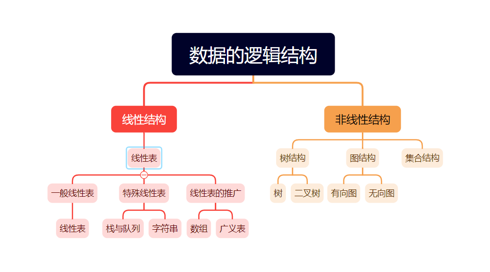

# 第一章 绪论

## 掌握

### 数据结构的基本概念和相关术语

- 数据：是客观事物的符号表示，是所有能输入到计算机中并被计算机程序处理的符号的总称
- 数据元素：是数据的基本单位，在计算机中通常作为一个整体进行考虑和处理
- 数据项：是组成数据元素的、有独立含义的、不可分割的最小单位
- 数据对象：是性质相同的数据元素的集合，是数据的一个子集
- 数据结构：是相互之间存在一种或多种特定关系的数据元素的集合（包括逻辑结构、存储结构和数据的运算）

### 数据的逻辑结构和存储结构的分类

#### 逻辑结构



#### 存储结构

##### 顺序存储

顺序存储结构是借助元素在存储器中的相对位置来表示数据元素之间的逻辑关系，通常借助程序设计语言的数组类型来描述

##### 链式存储

链式存储无需占用一整块存储空间，但为了表示结点之间的关系，需要给每个结点附加指针字段，用于存放后继元素的存储位置。所以链式存储结构通常借助于程序设计语言的指针类型来描述

## 熟悉

### 数据的逻辑结构、存储结构和运算之间的关系

- 数据的逻辑结构和存储结构是密不可分的两个方面，一个算法的设计取决于所选定的逻辑结构，而算法的实现依赖于所采用的存储结构
- 数据的存储结构是用计算机语言实现的逻辑结构，它依赖于计算机语言
- 施加在数据上的运算包括运算的定义和实现。运算的定义是针对逻辑结构的，指出运算的功能；运算的是实现是针对存储结构的，指出运算的具体操作步骤

### 时间复杂度和空间复杂度的概念和分析方法

#### 时间复杂度

一般情况下，算法中基本语句重复执行的次数是问题规模n的某个函数f(n)，算法的时间量记作T(n) = O(f(n))，它表示随问题规模n的增大，算法执行时间的增长率和f(n)的增长率，称作算法的渐进时间复杂度，简称时间复杂度

#### 空间复杂度

算法的空间复杂度S(n)定义为该算法所需的存储空间，它是问题规模n的函数，记作S(n)=O(g(n))

## 了解

- 数据类型：是一个值的集合和定义在此值集上的一组操作的类型
- 抽象数据类型：一般指由用户定义的、表示应用问题的数学模型，以及定义在这个模型上的一组操作的总称，具体包括三部分：数据对象、数据对象上关系的集合以及对数据对象的基本操作的集合

# 第二章 线性表

## 掌握

### 线性表的顺序存储的定义，查找、插入和删除等基本操作的是实现

#### 定义

```c
//静态分配
#define MaxSize 50			//定义线性表的最大长度
typedef struct {
    ElemType data[MaxSize];	//顺序表的元素
    int length;				//顺序表的当前长度
}SqList；				   //顺序表的类型定义
//动态分配
#define InitSize 100		//表长度的初始定义
typedef struct {
    ElemType *data;			//指示动态分配数组的指针
    int MaxSize,length;		//数组的最大容量和当前个数
}SeqList；				   //动态分配数组顺序表的类型定义
```

#### 初始化

```c
//静态分配
//Sqlist L；					//声明一个顺序表
void InitList(SqList &L) {
    L.length = 0;			//顺序表初始长度为0
}
//动态分配
void InitList(SeqList &L) {
    L.data = (ElemType *)malloc(InitSize*sizeof(ElemType));		//分配存储空间
    L.length = 0;		//顺序表初始长度为0
    L.MaxSize = InitSize;		//初始存储容量
}
```

#### 查找(按值查找，顺序查找)

```c
int LocateElem(SqList L,ElemType e) {
    for (int i = 0;i<L.length;i++) {
        if (L.data[i] == e) {
            return i+1;		//下标为i的元素等于e，返回其位序i+1
        }
    }
    return 0;		//退出循环，说明查找失败
}
```

#### 插入操作

```c
bool ListInsert(SqList &L,int i,ElemType e) {
    if (i<1||i>L.length=1) {		//判断i的范围是否有效
        return false;
    }
    if (L.length >=MaxSize){		//当前存储空间已满，不能插入
        return false;
    }
    for (int j = L.length;j>=i;j--) {		//将第i个元素及之后的元素后移
        L.data[j] = L.data[j-1];
    }
    L.data[i-1] = e;		//在位置i处放入e
    L.length++;		//线性表长度加1
    return true;
}
```

#### 删除操作

```c
bool ListDelete(SqList &L,int i,ElemType &e) {
    if (i<1||i>L.length) {		//判断i的范围是否有效
        return false;
    }
    e = L.data[i-1];		//将被删除的元素赋值给e
    for (int j = i;j<L.length;j++) {		//将第i个位置后的元素前移
        L.data[j-1]=L.data[j];
    }
    L.length--;		//线性表长度减1
    return true;
}
```

### 线性表的链式存储的定义，查找、插入和删除等基本操作的实现

#### 定义

```c
typedef struct LNode {		//定义单链表结点类型
    ElemType data;		//数据域
    struct LNode *next;		//指针域
}LNode, *LinkList;
```

#### 初始化

```c
//带头节点
bool InitList(LinkList &L) {		//带头结点的单链表的初始化
    L = (LNode*)malloc(sizeof(LNode));		//创建头结点
    L->next=Null;		//头结点之后暂时没还没有元素节点
    return true;
}
//不带头结点
bool InitList(LinkList &L) {		//不带头结点的单链表的初始化
    L=NULL;
    return true;
}
```

#### 查找

##### 按序号查找

```c
LNode *GetElem(LinkList L,int i) {
    LNode *p=L;		//指针p指向当前扫描到的结点
    int j = 0;		//记录当前结点的位序，头结点是第0个结点
    while(p!=NULL&&j<i) {		//循环找到第i个结点
        p = p->next;
        j++;
    }
    return p;		//返回第i个结点的指针或NULL
}
```

##### 按值查早表结点

```c
LNode *LocateElem(LinkList L,ElemType e) {
    LNode *p=L->next;
    while (p!=NULL&&p->data!=e) {		//从第一个结点开始查找数据域为e的结点
        p = p->next;
    }
    return p;		//找到后返回该结点指针，否则返回NULL
}
```

#### 
